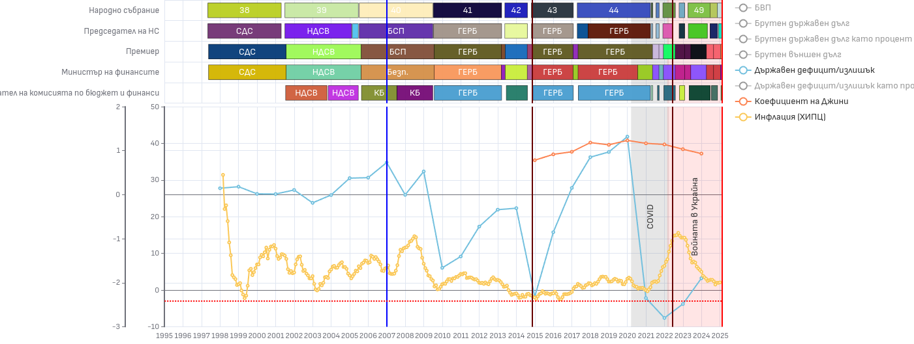

# Финансови и икономически показатели на България

Този проект визуализра различни финансови, икономически и други показатели на България, комбинирайки ги с други контекстуално свързани събития във времето.



# Използван софтуер

В проекта са използвани следните технологии и библотеки:

- [Angular](https://angular.dev/installation)
- [Bootstrap](https://getbootstrap.com/)
- [Apache ECharts](https://echarts.apache.org/examples/en/index.html)

# Стартиране

Статирането на този проект е изключително лесно като стандартна Angular апликация.

Инсталирайте библотеките

```bash
npm install
```

Стартирайте локалния сървер

```bash
ng serve
```

За подброни инструкции следвайте [официалната документация](https://angular.dev/installation) на Angular.

# Данни

Данните в проекта се намират в /data   
За подробна информация прочетете [data/README.md](public/data/README.md)  

# Допринасяне

Ако желаете да допринесете за подобряването на данните, кода, отстраняването на бъгове или подобряването на документацията, моля, направете pull request.  
